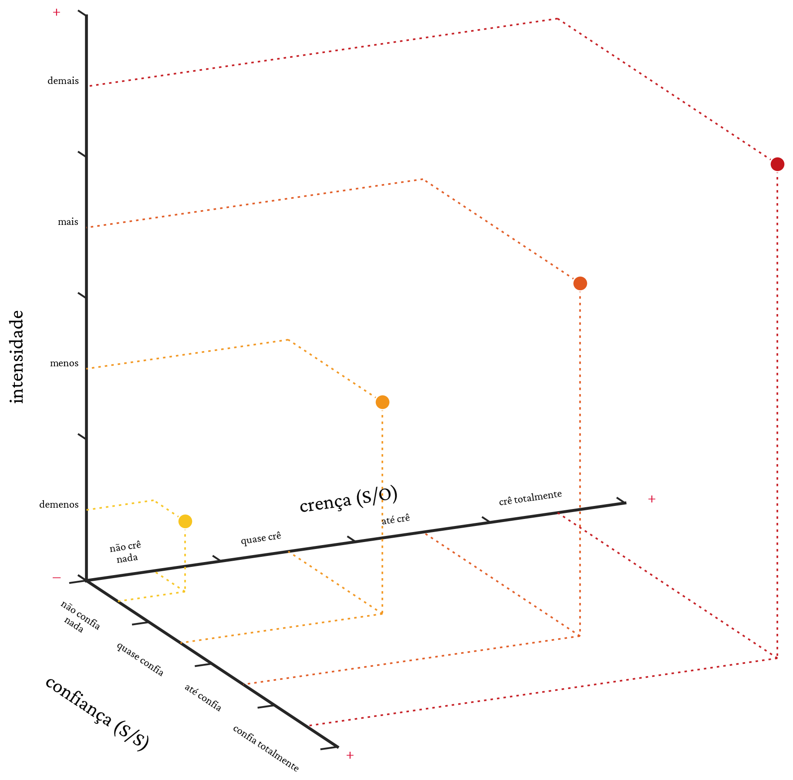
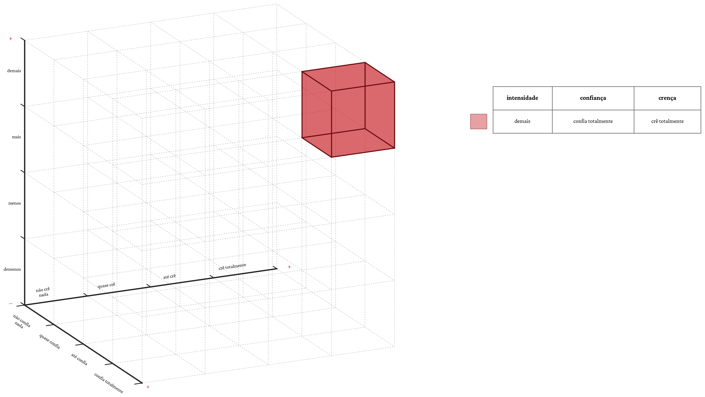
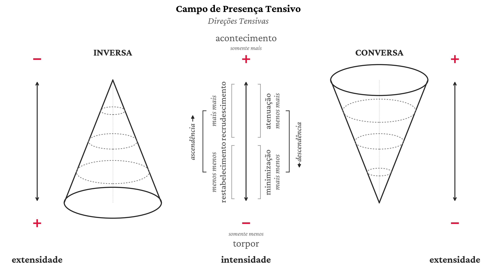
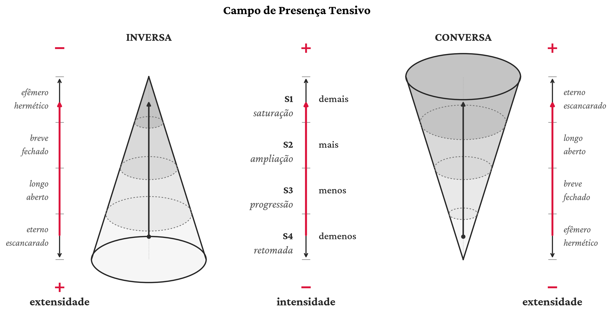

# Tensive Schemas

**Read in:** [Português](README.md) · English (current) · [Français](README.fr.md)

Two Python tools that generate, from code, the visualizations of two schemas
based on the tensive approach: Fontanille & Zilberberg, *Tension et 
signification* (1998), Zilberberg, *Eléments de grammaire tensive* (2001) et 
Zilberberg, *Structures Tensives* (2012):

- **`cubo_tri/`** — the **intensity space** (no extensity yet): two 3D tools
  crossing a graded category (such as **belief** (subject/object relation),
  **trust** (subject/subject relation)) and a graded measure of
  **intensity** — `cubo_tri_pontos_intensidade.py` (points and paths) and
  `cubo_tri_zonas_intensidade.py` (grid, highlighted zones and paths).
- **`campo_presenca/`** — the **field of presence**: the crossing of
  **intensity** and **extensity** in the two canonical correlations
  (**inverse** and **converse**), with the full tensive cycle
  (ascendency/descendency), paroxysms (event/torpor) and enriched versions
  (internal direction, intensity-based density).

Each folder has its own complete technical guide in `USO.md` (in Portuguese —
see [Mode 2](#mode-2--via-ai-no-coding-required) if you don't read
Portuguese). This README covers the overview and **the two ways to use this
repository**.

No programming is strictly required — see [Mode 2](#mode-2--via-ai-no-coding-required) below.

---

## Repository layout

```
cubo_tri/
  espacos.py              # EDITABLE content: axis gradations, spaces and paths
  cubo_tri_pontos_intensidade.py  # main module (CuboPontosIntensidade class + point factories)
  cubo_tri_zonas_intensidade.py   # grid, highlighted zones and paths (the 4 value spaces)
  gerar_zonas.py         # edit a list of zones at the top and run
  gerar_percursos.py     # edit paths (trajectories) at the top and run
  gerar_exemplos.py      # (re)generate all reference examples (points and zones)
  USO.md                  # full guide (Portuguese): axes, zones, paths, parameters
  exemplos/                # pre-generated reference PNGs (pontos/ and zonas/<space>/)
campo_presenca/
  campo_presenca.py       # base module (simple zones, tensive cycle)
  campo_presenca_puro.py  # enriched versions (internal direction, density)
  gerar_campo.py           # edit the desired version at the top and run
  USO.md                   # full guide (Portuguese): diagram reading, versions, parameters
  exemplos/                 # pre-generated reference PNGs
arco_tensivo/                # under construction
Crimson_Pro/                # font used in the figures (SIL OFL 1.1)
requirements.txt
```

## Examples

A few generated figures (click to enlarge):

<table>
  <tr>
    <td></td>
    <td></td>
  </tr>
  <tr>
    <td align="center"><i>pontos_fiduciario_conversa</i></td>
    <td align="center"><i>zonas_fiduciario_zona_completo</i></td>
  </tr>
  <tr>
    <td></td>
    <td></td>
  </tr>
  <tr>
    <td align="center"><i>campo_presenca_direcoes_tensivas</i></td>
    <td align="center"><i>campo_ambas_asc</i></td>
  </tr>
</table>

## Requirements

- Python 3.9+
- `numpy`, `matplotlib` (install with `pip install -r requirements.txt`)

---

## Mode 1 — terminal (for people who code)

```bash
git clone https://github.com/Bonin-gustavo/esquemas_semioticos
cd esquemas_semioticos
pip install -r requirements.txt

# intensity space — edit ZONAS in cubo_tri/gerar_zonas.py, then run:
cd cubo_tri
python3 gerar_zonas.py
python3 gerar_percursos.py
python3 gerar_exemplos.py   # (re)generate all reference examples

# field of presence — edit VERSAO in campo_presenca/gerar_campo.py, then run:
cd ../campo_presenca
python3 gerar_campo.py
```

The `gerar_*.py` scripts have an editable block at the top (labelled `EDITE
AQUI`, "edit here") — change the values (zones, paths, version, title) and
re-run. For advanced use (calling factory functions directly, combining
zones and paths, adjusting camera/figure), see the `USO.md` in each folder
(Portuguese; ask your AI assistant to translate on the fly if needed).

## Mode 2 — via AI (no coding required)

If you don't code, you can ask an AI assistant with file access and code
execution (OpenCode, Claude Code, OpenAI Codex, or any chatbot that can read
files and run code) to generate the image for you.

The simplest way is to **paste the repository link** into the chat:

1. Send the AI the link:

   > `https://github.com/Bonin-gustavo/esquemas_semioticos`

   The AI downloads the project and reads the files on its own — you don't
   need to install anything.

2. Describe what you want in plain language, pointing at the right folder.
   For example:

   > "In the `cubo_tri/` folder, read `cubo_tri_pontos_intensidade.py`,
   > `cubo_tri_zonas_intensidade.py` and `USO.md` (the Portuguese usage guide)
   > and generate an image highlighting the zone (crê totalmente, confia
   > totalmente, demais) in red, with the full grid."

   > "In the `campo_presenca/` folder, read `campo_presenca.py`,
   > `campo_presenca_puro.py`, and `USO.md`, and generate the field of
   > presence showing only the inverse correlation, enriched in density,
   > with the modulation starting at S1 and ending at S4."

3. The AI reads the code and `USO.md`, writes (or reuses) the right function
   calls, and runs the script — the result is the generated `.png` file.

If the AI has no internet access (or you prefer to download), use the
**Code → Download ZIP** button on GitHub (or `git clone`), unzip it, and
drag the folder into the chat (or open it as a project/workspace) — the
rest is the same.

The more specific the request (which zones, which correlation, which path),
the better the result. If you don't know the technical terms, describe what
you mean in plain language ("very intense and very trustworthy, but not
fully believed") — the AI can map that onto the right zones using `USO.md`.

---

## Theoretical background

Both schemas build on the tensive semiotics of Claude Zilberberg and Jacques
Fontanille (Fontanille & Zilberberg, *Tension et signification* (1998), Zilberberg, 
*Eléments de grammaire tensive* (2001) et Zilberberg, *Structures Tensives* (2012)):.

The gradations of the categories of the intensity cube are inspired by the
proposal of Soares and Mancini (2023):

SOARES, Vinicius Lisboa; MANCINI, Renata. Uma leitura tensiva das modalidades veridictórias.
Estudos Semióticos, São Paulo, Brasil, v. 19, n. 1, p. 15–29, 2023. DOI: 10.11606/issn.1980-4016.esse.2023.206156.
Available at: https://revistas.usp.br/esse/article/view/206156. Accessed: 11 Sept. 2026.

## How to cite

```
BONIN, Gustavo. Esquemas Tensivos: intensity space (points and zones) and
field of presence [software]. Programa de Pós-Graduação em Linguística,
Universidade de São Paulo, 2026. Available at:
https://github.com/Bonin-gustavo/esquemas_semioticos
```

## License

- **Code** (`.py`): [MIT](LICENSE)
- **Documentation and images** (`README*.md`, `USO.md`, `exemplos/*.png`):
  [CC BY 4.0](LICENSE-CONTENT.md)
- **Crimson Pro font** (`Crimson_Pro/`): [SIL OFL 1.1](Crimson_Pro/OFL.txt)
